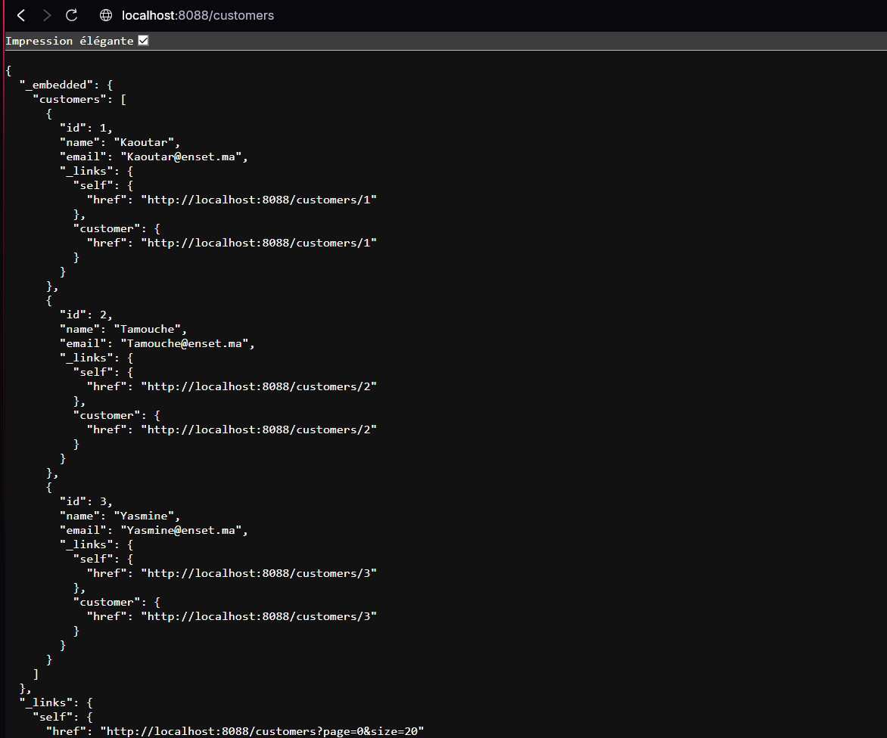
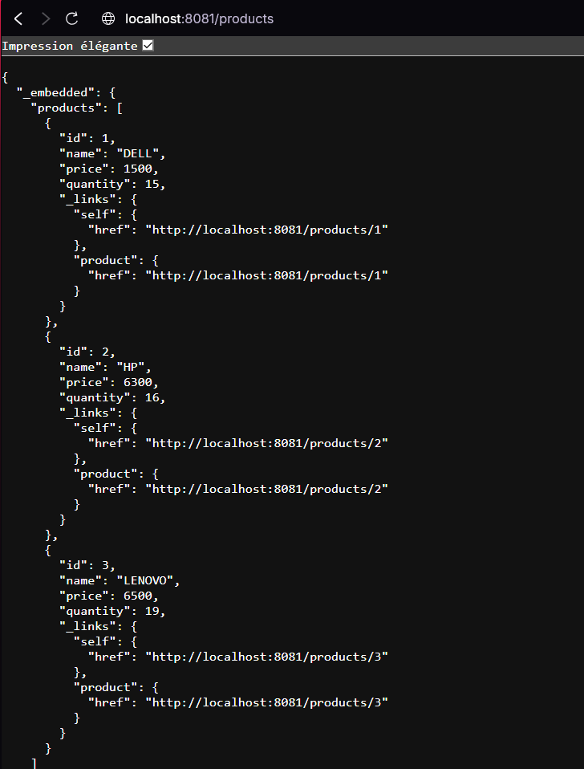
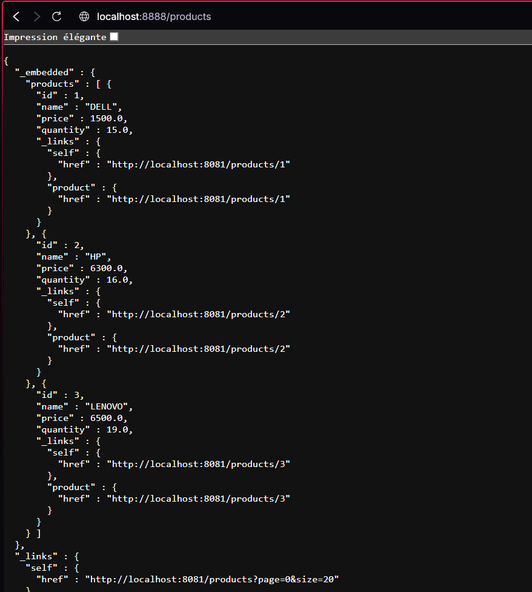

# Project Report: Microservice-Based Invoice Management Application

## Objective
The goal of this project is to develop a web application based on a microservice architecture to manage invoices, products, and customers. The application consists of independent microservices that communicate with each other via REST APIs. The services include a customer management microservice, a product management microservice, a billing microservice, a routing gateway, and a service registry (Eureka) for dynamic route management.

## Microservices Overview

### 1. Customer-Service Microservice
The first microservice developed is responsible for managing customer information.

- **Objective**: Provide APIs to add, update, delete, and retrieve customer information.
- **Actions Taken**:
  - Created a `Customer` entity to represent customers with attributes like `id`, `name`, and `email`.
  - Developed a `CustomerRepository` based on Spring Data for customer data management.
  - Exposed a RESTful API using Spring Data REST, allowing interaction with the database via auto-generated endpoints.
  - Tested the API by making HTTP calls to verify CRUD operations for customer data.

### 2. Inventory-Service Microservice
The second microservice is dedicated to managing products in the inventory, enabling addition, viewing, and management of product information.

- **Objective**: Provide APIs to manage products, including attributes like `name`, `price`, and `quantity`.
- **Actions Taken**:
  - Created a `Product` entity to represent products with attributes like `id`, `productName`, `price`, and `quantity`.
  - Developed a `ProductRepository` based on Spring Data for managing product persistence.
  - Exposed a RESTful API using Spring Data REST to enable easy access to products via auto-generated endpoints.
  - Tested the API to ensure proper product management functionality.

### 3. Gateway-Service Microservice
The Gateway microservice, built with Spring Cloud Gateway, serves as a single entry point for external requests and routes them to the appropriate microservices.

- **Objective**: Provide a centralized API to redirect requests to the relevant microservices based on routing logic.
- **Actions Taken**:
  - Configured Spring Cloud Gateway for route management.
  - Developed static routing configuration using the `application.yml` file to define redirection rules.
  - Tested the proxy service to ensure proper routing of requests to the correct microservices.

### 4. Registry-Service Microservice with Netflix Eureka
The Registry-Service microservice utilizes Netflix Eureka to register and dynamically manage services in the ecosystem.

- **Objective**: Allow each microservice to register in a central directory (Eureka Server), enabling dynamic service management and discovery by other microservices.
- **Actions Taken**:
  - Set up an Eureka server for service registration.
  - Configured microservices to automatically register with Eureka.
  - Tested the Eureka server to verify service registration and discovery through the registry.

### 5. Dynamic Proxy Configuration with Eureka
One key feature of this architecture is the ability to dynamically route requests to microservices registered in Eureka.

- **Objective**: Test the Gateway's ability to route requests to services registered in Eureka using dynamic configuration.
- **Actions Taken**:
  - Updated Spring Cloud Gateway configuration to interact with Eureka and dynamically use registered services.
  - Tested route management to ensure seamless communication between services via Eureka.

### 6. Billing-Service Microservice with OpenFeign
The Billing-Service microservice handles customer invoices and uses OpenFeign for communication between microservices.

- **Objective**: Provide a service capable of creating and retrieving invoices, integrating data from Customer-Service and Inventory-Service.
- **Actions Taken**:
  - Developed the Billing-Service API to handle invoice creation and retrieval.
  - Used OpenFeign to integrate communication between the billing service and the customer and product services.
  - Tested invoice creation using customer and product information to verify smooth interaction between services.

### 7. Angular Client for Invoice Display
To complete the application, an Angular client was developed to interact with the microservices and display invoices to the user.

- **Objective**: Create a user interface for viewing invoices associated with a specific customer.
- **Actions Taken**:
  - Created Angular components to display information related to invoices, products, and customers.
  - Set up Angular routing for navigation between different pages (products, customers, invoices).
  - Tested frontend integration with the microservices to ensure data is retrieved and displayed correctly to the user.

## Conclusion
This project successfully designed and implemented a microservice-based application for managing invoices, products, and customers. By using Spring Boot to develop the microservices, Spring Cloud Gateway for route management, Eureka for service registration, and OpenFeign for inter-service communication, a modular, scalable, and flexible system was created. The Angular frontend provides a user-friendly interface for viewing invoices and products, completing the overall solution.

## Project Screenshots

Here are some screenshots of the application:

